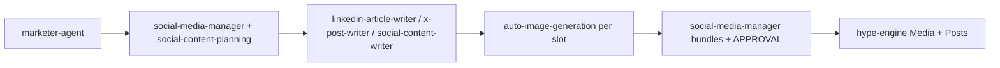

# Template: social feed pipeline (marketer → publish)

Copy this folder’s **content** into a new run directory:

```text
workspace/drafts/orchestration/<YYYY-MM-DD>-<run-slug>/
```

Then add `steps/*.md` from the sections below (or merge into one `dag.md` + `RUNLOG.md` per **`multi-agent-orchestrator`**).

## DAG (default: no caption writer)



**Optional branch:** `C --> C2[social-caption-writer] --> D` — only if the human wants a polish pass.

- **Gate before E:** human fills **`APPROVAL.md`** in the campaign folder.

## Step specs (minimal)

### Step 1 — `marketer-agent`

- **Inputs:** product brief (Drive / chat / file per skill).
- **Outputs:** `workspace/drafts/marketing/<date>-<slug>/` including **`README-handoff.md`**.
- **Then:** create/update **`workspace/drafts/social/<campaign>/pipeline-state.md`** — set `strategy` → `complete`, `calendar` → `pending`.

### Step 2 — `social-media-manager` + `social-content-planning`

- **Inputs:** marketer **`06-channel-plan.md`**, **`briefs/social-week-brief.md`** (or equivalent).
- **Outputs:** campaign folder with **`calendar.md`** (columns include **Post id**, **Draft path**).
- **Then:** `calendar` → `complete`, `post_bodies` → `pending`.

### Step 3 — Writers (pick per calendar row)

- **`linkedin-article-writer`** — LinkedIn **articles** only → `workspace/drafts/linkedin/...` + **`teaser.md`** + **`article-hero.png`**.
- **`x-post-writer`** — X only → **`posts/<post-id>/post-body.md`** (hashtags in-file).
- **`social-content-writer`** — short LinkedIn feed, Reddit, Facebook, mixed → **`posts/<post-id>/post-body.md`**.
- **Then:** run **`auto-image-generation`** per row → **`post-image.png`** or **`article-hero.png`** (+ `image-alt.txt`). **Then** `post_bodies` → `complete`; default **skip** caption step → go to bundles.

### Step 3b — *(Optional)* `social-caption-writer`

- **When:** human asks for extra hooks / hashtag variants.
- **Outputs:** `captions/<date>-<topic>-<platform>.md`.

### Step 4 — `social-media-manager` (bundles)

- **Inputs:** `post-body.md` and/or `teaser.md`, **`post-image.png`** or **`article-hero.png`**, (+ optional captions).
- **Outputs:** `posts/<post-id>/post-bundle.md` (includes **`## Image`** block), **`APPROVAL.md`** (image path column).

### Step 5 — `hype-engine`

- **Inputs:** approved rows in **`APPROVAL.md`** + image files from bundle. **Skip** any row whose **`HypeEngine post UUID`** is already set (*idempotency*).
- **Then:** **Media API** upload → **one POST `/posts` per row** with **`date` + `time`** from **`APPROVAL.md`**, **`content[].media`**, and body HTML—HypeEngine **queues and publishes** at that time (**no** separate publish-now API). Write **post UUID** (+ media UUID) to **`APPROVAL.md`** → `publish` phase → `complete`.
- **Note:** Images use **`brand-images/`** / **`BRAND_IMAGES_DIR`** per **`auto-image-generation`**. **LinkedIn long-form `article.md`** is **not** posted via HypeEngine; **interns** publish the article (with **`article-hero.png`**). **Google Drive** = articles only, not feed posts.

## Operator one-liner

> Read **`workspace/drafts/social/<campaign>/pipeline-state.md`**, find the first row not `complete`, run the **Next skill** for that step, then update the file.

## RUNLOG snippet

Append to **`RUNLOG.md`** after each step:

```text
| ISO timestamp | Step | Skill | Status | Output path |
```
